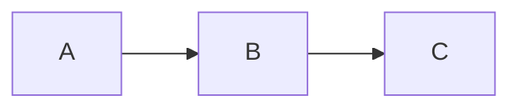

[Radioactive decay](https://en.wikipedia.org/wiki/Radioactive_decay#Mathematics_of_radioactive_decay) is the process by which an unstable atomic nucleus emits radiation such as an alpha particle, beta particle or gamma particle with a neutrino. This process is a good example of exponential decay. 

Consider the case of $N_A$ decaying to $N_B$,   $N_A \rightarrow N_B$. In this case decay rate is proportional to number of atoms present $N_A$. Adding, a constant of proportionality or the decay constant, which is unique to every element, we get a general differential equation 	


$$\frac{dN_A}{dt}  = - \lambda_A N_A$$


In the case of element $N_A$ decaying to $N_B$ decaying to $N_C$ (stable), $N_A \rightarrow N_B \rightarrow N_C$,



the first decay is represented by the above equation however we need a new differential equation for the second decay of $N_B \rightarrow N_C$. Since the number of $N_B$ increases as a result of activity from $N_A$ and decreases due to its own decay into $N_C$, we can form a differential equation as follows 

\begin{equation}
\frac{dN_B}{dt}  = - \lambda_B N_B + \lambda_A N_A
\end{equation}

 The creation rate of the stable $N_C$ atoms is simply the activity of $N_B$, considering its independent decay 
 
 \begin{equation}
\frac{dN_C}{dt}  =  \lambda_B N_B 
\end{equation}

For this model, the following values were assumed:


| Command           | Value | Description            |
| ------------------| ------|----------------------- |
| $t_{halfA}$            |    1.1 hours   | time for half of $N_A$ atoms to decay    |
| $t_{halfB}$   |   9.2 hours    | time for half of $N_B$ atoms to decay     |
| $N_A(0)$   |     100  | number of atoms of $N_A$ at $t=0$     |
| $N_B(0)$  |    0   | number of atoms of $N_B$ at $t=0$     |
| $N_C(0)$   |    0   | number of atoms of $N_C$ at $t=0$    |
| $t_{final}$   |  50 hours     | time for full simulation    |


#### Analytical Solutions
This approach included solving the first three equations by integrating both sides to find equations for $N_A(t)$, $N_B(t)$ and $N_C(t)$. The first equation was solved to,

\begin{equation}
N_A(t)  = N_A(0)e^{-\lambda_A t}
\end{equation}

or, the decay constant can be represented as 

\begin{equation}
\lambda_A = \frac{ln2}{t_{half_A}}
\end{equation}

This formula is later used to calculate $\lambda_A$, $\lambda_B$ and $\lambda_C$  

Similarily, solving the second equation we get 

\begin{equation}
N_B(t)  = \frac{N_A(0)\lambda_A}{\lambda_B - \lambda_A} (e^{-\lambda_A t} - e^{-\lambda_B t})
\end{equation}

and solving the third we get

\begin{equation}
N_C(t)  = N_C(0) + \lambda_B N_B(0) (1 - e^{-\lambda_Bt}) + \frac{N_A(0)}{\lambda_B - \lambda_A} (\lambda_B(1 - e^{-\lambda_A t}) - \lambda_A(1 -e^{-\lambda_B t}))
\end{equation}


where values of $N_A(0)$, $N_B(0)$ and $N_C(0)$ are assumed as initial parameters and $\lambda_B$ is calculated similarly to $\lambda_A$ for which the values of $t_{half}$ is taken from the above table.

#### Numerical Solutions

Here, the finite difference approach was used in computing the values for $N_A(t+\delta t)$, $N_B(t+\delta t)$ and $N_C(t+\delta t)$ which are essentially the values of $N_A(t)$, $N_B(t)$ and $N_C(t)$ for every time step given an initial $N_A(0)$, $N_B(0)$ , $N_C(0)$ and $\delta t$. By definition, a derivative is 
 
$$ \frac{df}{dt}  = \lim_{\delta t \rightarrow 0 } \frac{f(x+\delta t)-f(x)}{\delta t}$$

Applying this to the first three differential equations we get

$$\frac{N_A(t+\delta t)-N_A(t)}{\delta t}  = - \lambda_A N_A(t)$$


$$\frac{N_B(t+\delta t)-N_B(t)}{\delta t}  = - \lambda_B N_B(t) + \lambda_A N_A(t)$$

$$\frac{N_C(t+\delta t)-N_C(t)}{\delta t}  =  \lambda_B N_B(t) $$

re-arranging, 
\begin{equation}
N_A(t+\delta t)  = - \lambda_A N_A(t)\delta t + N_A(t) 
\end{equation}
\begin{equation}
N_B(t+\delta t)  = (- \lambda_B N_B(t) + \lambda_A N_A(t))\delta t + N_B(t) 
\end{equation}
\begin{equation}
N_C(t+\delta t)  =  \lambda_C N_C(t)\delta t + N_C(t) 
\end{equation}
It is to be noted that three different values of $\delta t$ were considered, 1 hour, 0.5 hours and 0.25 hours, and their impacts on the model were mainly in increasing the granularity (smoothness) of the different curves. 

Lastly, the above equations just need to be converted into numpy arrays.

```sh
na[i] = (- lambda_list[0] * na[i-1] * t_del) + na[i-1]

nb[i] = ((-lambda_list[1]*nb[i-1]) + (lambda_list[0]*na[i-1]))*t_del 
						+ nb[i-1]

nc[i] = (lambda_list[1]*nb[i-1]*t_del) + nc[i-1]
```
To iteratively acheive this, these were then programmed as a function $numerical$ which accepts lists of $N(0)$ and $\lambda$ values and $\delta t$ and outputs a list whose elements are the arrays $N_A(t)$, $N_B(t)$, $N_C(t)$ and $t$ (which contains the time values used for plotting), based on the code below. The core equations were modeled as follows between $t = 0\ to\ t_{final}$  with $\frac{t_{final}}{\delta t}$ time steps. The final graph is shown below. Notice how $N_A$ decays considerably faster than $N_B$ which is in line with the half-life assumptions.




